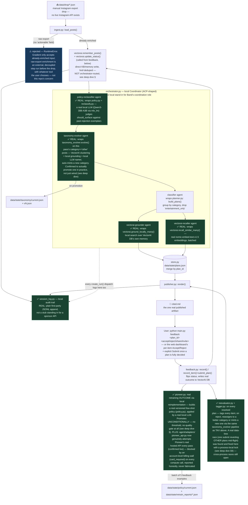

# RUNBOOK — Gradient

See also: **[DEMO.md](docs/DEMO.md)** (how to actually run a pass, day-of),
**[GAPS_AND_FILL.md](docs/GAPS_AND_FILL.md)** (fresh-machine setup checklist + one fill action per
gap below), **[BENCHMARKS.md](docs/BENCHMARKS.md)** (what to measure and expected ranges, once a
test harness exists), and **[ROADMAP.md](ROADMAP.md)** (forward-looking: what to build next, not
what's left to fix). This doc is the architecture + honest real-vs-stub reference the others
point back to.

## What this is

A hackathon entry (brief.md — "Self-Evolving Agents Hackathon," July 24 2026) that turns a
manually-exported dump of a person's saved/liked Instagram posts into actionable "interest
plans," publishes them to `cited.md`, and is meant to close the loop by retraining itself on
the user's accept/reject/share/invite feedback.

A human is very much still in this loop — the accept/reject/share/invite decision *is* the
training signal, and nothing works without it. The "no manual intervention" claim in the code
is narrower than that: it's about (1) the ingest→plan→ground→publish→retrain-check pipeline
running unattended between drops, with no person needed to trigger each stage, and (2) Pioneer's
model-*promotion* step specifically — its real design has a human approve promoting a retrained
checkpoint, and this stub auto-promotes instead (see §9). That second point is the one actual
piece of human oversight the hackathon submission removes, not the feedback loop itself.

This document describes only what happens **inside this repo**. Its starting point is
already-classified post data — each post carrying a `category`/`subcategory`/`actionable`/
`action` (see §2) — produced upstream by a separate tool, **InstaGone**. InstaGone's own
pipeline (how it gets from a raw export to that classified shape) is out of scope here; what
matters to this repo is only the shape of data it expects to receive.

It's a thin orchestration layer (`agent/loop.py`) that takes that classified data and layers a
small number of *genuinely real* integrations on top, rather than a stub for every tool named in
the hackathon brief. That's a deliberate local-first stance, not an oversight: **VectorAI DB and
Pioneer are real, live integrations. Grounding (what "Senso" used to do) is local now too —
`vectorai.ground_locally()` grounds an interest in other posts the user actually saved via
VectorAI DB's own search, the same collection episodic recall already used, replacing a hosted
KB search that only ever contained content this project itself pushed into it (see `ROADMAP.md`
§1 for the full reasoning). Governance/audit-logging (what "Guild" would have covered) and
session recording (what "Replay.io" would have covered) are handled locally —
`agent/session_log.py` is a genuine first-party local audit trail, not a stub standing in for a
hosted API, and Replay.io was dropped outright (a live key sat unused in `API.md` with zero
adapter code — never pursued, not worth pretending otherwise).** Pioneer's own hosted API is
genuinely called every retrain pass now — confirmed live (auth works, read-only endpoints return
real 200s) — but every compute-consuming call hits a hard account-level billing wall
(`card_required`, no bypass found) on this project's key, so no real training job actually
completes; the retraining outcome that changes behavior still comes from a local reimplementation
(a real local LLM applying a versioned few-shot policy), which keeps running regardless of what
Pioneer's API does. Monetization (x402/CDP) was dropped outright as out of scope (§7) — see the
diagram and deep dive below for exactly which.

Run it with:
```
python main.py once                        # one ingest → plan → publish → retrain-check pass
python main.py loop --interval 86400       # repeat forever, polling data/drop/ (default: 60s — see note below)
python main.py feedback <plan_id> <accept|reject|share|invite>
```

Note on `--interval`: the flag defaults to 60 seconds in the code
(`main.py`'s `loop` subparser), but that number is disconnected from how often there's
actually anything new to find. Meta's "Download Your Data" export isn't something a person
generates continuously — realistically a new export lands weekly, or daily at the very most.
A 60s loop just re-checks an empty `data/drop/` almost every single pass. `--interval 86400`
(daily) or longer is the cadence that actually matches the input source; nothing in the code
enforces or suggests this, so it's easy to run it needlessly tight.

---

## Diagram — data flow, with gaps marked

`✅` = real, live integration · `🟡` = real, but fragile/single-machine dependent · `⚠️` = stub/simulated, no real backend



---

## Deep dive

### 1. Entry points (`main.py`)

Three subcommands, all thin wrappers around `agent/loop.py` and `agent/feedback.py`:

- **`once`** → `loop.run_once()`. Runs exactly one
  ingest→reclassify→classify→ground/recall→publish→retrain-check pass and prints the result
  JSON. This is what a CI cron or manual trigger would call.
- **`loop --interval N`** → `loop.run_loop()`. Calls `run_once()` in a bare `while True` with
  `time.sleep(N)` between passes — no backoff, no jitter, no signal handling for graceful
  shutdown, single process, no locking against a second instance running concurrently.
- **`feedback <plan_id> <decision>`** → `agent/feedback.record()`. The second of two
  human-facing touchpoints in the system (the first being manually dropping an export file
  into `data/drop/` — see §2), and the thing that's supposed to make the "self-evolving" claim
  real: it's the production label Pioneer's real local retraining loop (§9) later reads to
  decide what to promote.

### 2. Ingestion (`agent/ingest.py`)

There is no live API for a personal account's saved/liked posts — Meta only offers a manual
"Download Your Data" export. So the trigger for the whole loop is **new files landing in
`data/drop/`**, not any kind of polling of Instagram itself. `run_once()` diffs the folder
against `data/state/processed_files.json` to find files it hasn't seen.

**The actual starting point for everything in this repo is a JSON file of already-classified
posts** — a list of objects each shaped roughly like `{"href": ..., "category": ...,
"subcategory": ..., "actionable": ..., "action": ..., "key_facts": [...]}`. That's the only
input contract this document describes: given data in that shape, here is what this repo does
with it.

A dropped file can also arrive as a **raw export** — hrefs only, none of the fields above.
`load_posts()` no longer does anything with that case except raise a clear `RuntimeError`
explaining the shape it expected. This used to shell out to a sibling project (InstaGone) via
a hard-coded absolute path in `agent/config.py` to enrich raw exports in place — that coupling
was removed deliberately: Gradient's own scope is the plan/ground/evolve/feedback loop over
already-classified data, not owning a specific external enrichment tool's location on one
machine. Turning a raw export into the classified shape above is still a real step someone
needs to run — just outside this repo, with whatever tool they choose — and its output dropped
into `data/drop/` like any other input.

A bad/malformed drop file (raw export or otherwise) no longer blocks the rest of a batch either
— `run_once()` isolates each file's processing (`agent/loop.py`'s `_process_drop_file()`), logs
the failure, and continues to the next file; the failed file just isn't marked processed, so
it's retried next pass.

`data/state/` is gitignored and gets recreated fresh on first run — it's local runtime state,
not part of the repo. A verification run (`./venv/bin/python main.py once`) against the
git-tracked `fixtures/demo_export.json` (see GAPS_AND_FILL.md Part 1 §5 for what's in it — 22
real, classified posts across 9 categories) confirmed the full pipeline end-to-end: 9 plans
produced, 0 low-signal posts filtered, real grounding and real VectorAI DB recall on every
plan, zero failed agent dispatches (grounding was still Senso-backed at the time this line was
first written; re-verified since on local grounding, see §5). The earlier version of this line referenced
`data/drop/sample_export.json`, a real personal Instagram export used during development — that
file was never git-tracked and no longer exists on disk; `fixtures/demo_export.json` is its
git-tracked, curated replacement (DEMO.md §4 walks through the full feedback/retrain loop against
it).

Note: an earlier `sample-data/` (top-level) held non-runtime example input/output fixtures for
reference; it was removed once `fixtures/demo_export.json` became the one real, git-tracked
sample — no code path ever read it, so nothing else changes.
The live input directory is `data/drop/`.

**Upstream data-quality wishlist for InstaGone.** InstaGone is a separate, sibling tool that can
evolve in parallel with this agent — the following would materially improve what this repo's
category-mapping (`agent/adapters/vectorai.py`'s `top_k_anchors_many()`) and actionability
pipeline (`agent/actionability.py`, `agent/export_type_evolver.py`) can build on top of, without
this repo needing to reverse-engineer them via regex:

1. **Emit structured entities directly**, e.g. `extracted_entities: {music_tracks: [{artist,
   track}], place: {name, lat, lng}, recipe: {name, ingredients: [...]}}`. InstaGone already has
   the OCR/caption text in hand at classification time — asking it to structure the entities it
   recognizes removes an entire fragile regex-extraction layer from this repo
   (`agent/actionability.py`'s hand-written extractors exist only because this data isn't
   structured today).
2. **Dedicated `lat`/`lng` numeric fields** when a location is detected, instead of coordinates
   appearing as a substring inside `caption_clean`/`ocr_text` (today extracted here via a
   GPS-string regex over free text — fragile).
3. **A documented, stable rule for `suggested_collection`** — the fixture data shows it sometimes
   matches `category`, sometimes doesn't, with no discoverable rule. Either document what
   determines it or fold it into one authoritative signal. (This repo now carries it through as
   read-only provenance — `item["source_collection"]` in `agent/planner.py` — but never as a
   grouping key, since its semantics relative to `category` aren't pinned down upstream.)
4. **A `confidence` score alongside `category`/`actionable`**, so this repo's vector
   category-mapping and export-type evolution can weight InstaGone's own certainty instead of
   treating every classification as equally reliable.
5. **A stable post identity** (`media_id`/content hash) distinct from `href` — Instagram
   permalinks can change/expire, and this repo currently keys everything off `href` (dedup in
   `store.merge_plans()`, VectorAI point IDs).
6. **Expose InstaGone's own classification embedding (or model/version)**, if one already exists
   internally — would let this repo evaluate reusing it instead of re-embedding everything via
   `nomic-embed-text-v1.5`, avoiding duplicate compute across the two tools.

None of this blocks anything currently implemented here — it's written down so the two projects'
evolution stays coordinated rather than this repo permanently working around gaps that would be
cheaper to close upstream.

### 3. Planning (`agent/planner.py`)

Groups posts by `category` into one "plan" per interest, reusing InstaGone's existing
`actionable` classification rather than inventing a new quality signal:
`entertainment_only` posts are filtered out of plans (but counted and shown in `cited.md` as
"N low-signal posts filtered" for transparency). Every other post is treated as
high-quality/actionable.

**Weak point:** quality filtering is a single hard-coded set (`LOW_QUALITY_ACTIONABLE =
{"entertainment_only"}`), entirely dependent on InstaGone's classifier being accurate — this
agent has no independent quality check of its own.

### 4. Local orchestration (`agent/orchestrator.py`)

This is the local stand-in for **Band**, the hackathon's coordination-layer sponsor. Band
would give named agents in shared rooms with explicit `@mention` routing and a unified audit
trail — reasonable for coordinating agents across *different machines/frameworks*, but every
agent this codebase runs lives in the same Python process, so that's a network round-trip
(and an external account) for zero benefit at this scale. `orchestrator.py` borrows the data
shapes of **ACP** (Agent Communication Protocol) instead — an Agent Manifest for discovery, a
`Run` as one agent execution over input/output `Message`/`MessagePart` — without ACP's HTTP
transport. (Worth noting: the standalone ACP spec/repo was archived 2025-08-27 and folded into
A2A under the Linux Foundation; irrelevant here since nothing in this module talks over a
network, but relevant if this pattern is ever pointed at a real remote agent.)

A `Coordinator` registers five named agents and dispatches `create_run(agent_name, input)` to
them; a handler that raises fails only its own run (logged to the session log) instead of the whole
pass. `loop.py` calls all five instead of calling
`planner`/`policy`/`reclassify`/`vectorai`/`taxonomy_evolver` directly:

| Agent | Wraps | Real? |
|---|---|---|
| `policy-reclassifier` | `policy.load_current()` + `reclassify.apply_policy()` | ✅ real (§9) |
| `classifier` | `planner.build_plans()` | plain local logic, no sponsor claim |
| `vectorai-grounder` | `vectorai.ground_locally_many()`, batched across all of a pass's plans | ✅ real (§5) |
| `vectorai-recaller` | `vectorai.recall_similar_many()`, batched across all of a pass's plans | ✅ real (§5) |
| `taxonomy-evolver` | `taxonomy_evolver.evolve()` on this pass's `category == "other"` posts | ✅ real — confirmed to actually promote a category in practice, not just wired (see below) |

**Deliberately out of scope:** the KB/memory *write* step — `vectorai.remember_posts()`,
`vectorai.update_status()` — stays a direct call, not an agent. It's href-dedup bookkeeping tied
to its own state file (`vectorai_remembered.json`), not an "input in, output out" pipeline
stage; wrapping it would add ceremony without payoff. This is a boundary decision, not an
oversight. (This used to be two write steps — a matching Senso ingest ran alongside VectorAI DB
remember — until grounding moved off Senso entirely; see ROADMAP.md §1.)

Verified end-to-end (see §2): one real run produced 1 `policy-reclassifier` dispatch, 1
`classifier` dispatch, 1 batched `vectorai-recaller` dispatch, and 1 batched `vectorai-grounder`
dispatch (grounding every new plan's interest in one embed-subprocess call, not one per plan —
same batching discipline as recall) — all `"completed"`, zero failures, all logged to
`session_log.jsonl` as `orchestrator_run` events. Re-verified live after the Senso decoupling: a
"food and cooking" plan's grounding correctly returned real citations from *other* saved
food-and-cooking posts (a sourdough post's own href excluded from its own plan's citations, as
designed). `taxonomy-evolver` dispatches every
pass too (one `taxonomy_evolve` session-log event each time) and has been directly observed promoting
a real category (`"home coffee roasting"`, from a genuine 3-post cluster with real grounding
citations and a cleared reuse-check) — treat that as "the mechanism works," not a claim about
what `data/state/taxonomy/current.json` contains *right now*, since this repo's `data/state/`
gets wiped and reseeded for fresh test runs often enough that a specific promotion's on-disk
evidence doesn't persist.

### 5. Grounding & memory — one real integration, two roles

Used to be two integrations here (Senso for grounding, VectorAI DB for memory). Senso's
`ground()` searched a hosted KB that only ever contained content this project's own
`senso.ingest_post()` had pushed into it — no independent external corpus, just this pipeline's
own data round-tripped through a network call. That redundancy is why it was decoupled (see
`ROADMAP.md` §1 for the full reasoning); `agent/adapters/senso.py` is deleted.

**`agent/adapters/vectorai.py`** is now the one real integration doing both jobs — Actian
VectorAI DB, self-hosted via Docker (`docker-compose.yml`, gRPC on `localhost:6574`):

- **Memory** (`remember_posts()`/`recall_similar_many()`/`update_status()`): every high-quality
  post gets embedded and upserted with its plan status, so the agent can answer "have we seen
  something like this before, and what happened to it" — real episodic memory with a concept of
  past accept/reject outcomes, which Senso's old `ground()` never had.
- **Grounding** (`ground_locally()`/`ground_locally_many()`, new): searches that same collection
  for *other* posts (excluding a plan's own items) supporting an interest, returning citations
  in the same shape Senso's `ground()` used to (`{"grounded": bool, "citations": [str, ...],
  "source": str}`) — a drop-in swap at both call sites (`vectorai-grounder` agent, §4;
  `taxonomy_evolver.evolve()`'s promotion-evidence check, §9). `ground_locally_many()` batches
  exactly like `recall_similar_many()` (one embed subprocess call for a whole pass's plans, not
  one per plan) — the `senso-grounder` agent used to dispatch once *per plan* since Senso's HTTP
  call was cheap enough not to matter; a local embed call is not, so `loop.py`'s grounding
  dispatch was restructured to batch at the same point recall already did.
- Citations are built from the same payload every memory point already carries
  (`subcategory`/`action` — see `_flatten_citation()`), not a new text field — no schema change
  needed to make local grounding work.
- Always degrades to a stub result on any failure (`grounded: false, source: "stub"`), same
  resilience contract as the rest of this adapter and as Senso's old `ground()` — a stopped
  Docker container or missing model cache never breaks publishing.

- Embeddings are **real local model output**, not a hashing trick and not a cloud API call:
  `embed_batch()` subprocesses into this repo's `venv/` (the same isolated env
  `_reclassify_worker.py` uses for `mlx_lm`) and runs `nomic-embed-text-v1.5` via
  `agent/_embed_worker.py` — already cached locally, `HF_HUB_OFFLINE=1` forces a loud failure
  rather than a silent network call if the cache is ever missing.
- **Batched, not per-item:** model load costs ~10s, so `remember_posts()` and
  `recall_similar_many()` pay that cost once per pass, not once per post/plan.
  `remember_post()`/`recall_similar()` still exist as single-item convenience wrappers, but
  `loop.py` (and the `vectorai-recaller` agent, §4) always use the batch form — using the
  single-item form in a loop would silently reintroduce the one-model-load-per-item cost this
  design specifically avoids.
- `update_status()` is called from `feedback.record()` to write the real
  accept/reject/share/invite outcome back onto the remembered point, so future recall reflects
  what actually happened, not just what was proposed.
- `recall_similar_many()` drops hits below `MIN_RECALL_SCORE = 0.55` — calibrated against
  `nomic-embed-text-v1.5`'s ~0.4–0.5 baseline similarity between unrelated short phrases, so a
  real category match (0.7+ in manual testing) doesn't get drowned out by noise. A real recall
  observed in verification scored between 0.55–0.62 across *different* categories (e.g. a "food
  and cooking" plan recalling "technology and innovation" memories) — plausible given the
  embedding is topic/phrasing similarity, not a guarantee of category-level precision; worth
  watching if recall quality matters more than it does in this demo.

### 6. Publishing (`agent/publisher.py`)

Renders `data/state/plans.json` into `cited.md` — the actual deliverable per the brief
("Publish Agent's output to cited.md"). Plans are sorted by item count, annotated with a
status emoji, and include the CLI command a user would run to give feedback. This is
regenerated on every `run_once()` pass and every `feedback()` call, so it's always current
with plan state — but it's a full-file rewrite each time (`config.CITED_MD.write_text`), not
an append or diff, so anything a person hand-edited into `cited.md` between runs is lost.

### 7. Monetization — dropped, out of scope

`agent/adapters/payments.py` used to render a static x402/CDP paywall banner into every
`cited.md` (`PAYWALL_NOTICE`) with `is_unlocked()` unconditionally returning `True` — cosmetic
text describing a paywall that gated nothing, metered nothing, and collected nothing. That's
gone now: monetization was decided to be out of scope for what this agent is actually for
(processing and evolving on saved-post feedback), not a feature worth simulating with fake UI
just because the brief mentioned payment rails. `payments-research.md`'s x402/CDP design notes
are left as-is for historical record, not as a live plan.

### 8. Local session log (`agent/session_log.py`)

Every stage logs an event via `session_log.log_session()`, appending JSON lines to
`data/state/session_log.jsonl`. This used to be an "adapter" for a sponsor tool (Guild) with no
API key ever configured — a stub pretending to be a pluggable external service. That framing was
dropped: this repo's stance is local-first, and an audit trail that's genuinely local by design
isn't a gap waiting for a hosted API, it's the intended architecture. What's still true either
way: it's a flat file with no rotation, no access control, and no schema enforcement — real
limitations of a plain JSONL append, not specific to the rename.

### 9. Feedback → real retraining (`agent/feedback.py`, `agent/policy.py`, `agent/reclassify.py`, `agent/adapters/pioneer.py`)

`feedback.record()` is the only place a human touches the system after the initial export
drop. It flips the plan's status, queues a per-item labeled example for Pioneer
(`submit_feedback` — one example per post, not a plan-level rollup, since policy synthesis
needs real subcategory/action content), writes the real outcome back to VectorAI DB
(`vectorai.update_status()`), logs to the local session log, and re-renders `cited.md`.

This is where the "self-evolve" claim actually gets tested, and — contrary to what an earlier
version of this document said — **it is not simulated math anymore**. `pioneer.maybe_retrain()`
now produces a real artifact:

- Once 5 feedback examples queue up (`RETRAIN_BATCH_SIZE`), the newest exemplars are merged
  with `policy.load_current()`'s prior ones (capped at `MAX_EXEMPLARS = 12`, newest first) and
  written as a new versioned policy (`policy.promote()` → `data/state/policy/vN.json` +
  `current.json`).
- That policy is *applied*, not just logged: `reclassify.apply_policy()` subprocesses into
  `agent/_reclassify_worker.py`, which loads a real local model
  (`mlx-community/Qwen3-30B-A3B-4bit` via `mlx_lm`, same `venv/` as the embedding worker) and judges
  each new post's `should_surface` against the policy's few-shot exemplars — genuine in-context
  learning off real accept/reject content, run through the `policy-reclassifier` agent (§4) on
  every pass. High-confidence suppressions actually drop the post from that pass's plans, not
  just a log line. The model choice is itself a documented finding, not arbitrary: the code
  comment records that `Qwen3-8B` was tried first and "reliably contradicted its own stated
  reasoning" (e.g. concluding "does not match any BAD example" and then setting
  `should_surface: false` anyway) — 30B-A3B replaced it because a judgment that gates what
  gets published needs more than a fast-iteration-tier model. (The file's own docstring header
  still says "Qwen3-8B-8bit," stale relative to the actual `MODEL_ID` a few lines below it —
  minor, but worth a cleanup pass.)
- **Promotion is now unconditional** — the `eval_delta`/`AUTO_PROMOTE_THRESHOLD` gate this
  document previously described no longer exists in the code. `eval_delta` is computed and
  reported, but `policy.promote()` runs regardless of its sign. Directly observed: a real
  retrain report showed `"eval_delta": -1.0` — all 5 queued examples were rejections — yet
  `"promoted": true` (this repo's `data/state/` gets wiped for fresh test runs often enough that
  the specific report file this came from is no longer on disk — re-run to reproduce rather than
  looking for that exact file). This is a defensible design choice
  for a few-shot-exemplar system (a rejection is just as valid an "avoid this" training example
  as an acceptance is a "keep doing this" one — there's no "worse model" to guard against the
  way a real eval gate would), not the "no quality bar" flaw a numeric-threshold version would
  have. Worth naming plainly rather than softening: there is still no gate of any kind, on
  purpose.
- Human-in-the-loop promotion approval — Pioneer's actual real-world design — is still
  **deliberately absent**, per the adapter's own docstring, to satisfy the hackathon's autonomy
  judging criterion. What changed is that "promotion" now means something real (a policy that
  measurably changes which posts surface) instead of a report nobody reads.
- **Pioneer's own sponsor API is now genuinely called — and hits a real billing wall.**
  `agent/adapters/pioneer_api.py` is a new, additive module `pioneer.maybe_retrain()` calls on
  every retrain pass: real auth (`X-API-Key`, confirmed against `API.md`'s key), real read-only
  calls that return live 200s (`GET /felix/datasets`, `/base-models`, `/felix/training-jobs`,
  `/billing/usage/requests`), and a real attempt at the full write path — build an SFT dataset
  from the feedback queue, `POST /felix/datasets/upload/url` → `PUT` to the presigned URL →
  `POST /felix/datasets/upload/process` → `POST /felix/training-jobs`. Every compute-consuming
  call in that chain returns the identical `{"code": "card_required", ...}` 403 on this
  project's account — confirmed this is an account-level billing gate, not something a request
  can route around (tried alternate team/org headers and body fields, all identical error; no
  hackathon-credit or free-tier path is documented anywhere for it). A real retrain report on
  disk (`data/state/retrain_reports/20260724T231104Z.json` at the time — this repo's
  `data/state/` gets wiped and reseeded for fresh test runs often enough that citing a specific
  live file's contents goes stale within minutes; treat this as "directly observed once," not a
  pointer to what's on disk right now) showed exactly this:
  `pioneer_api.stage: "dataset_upload_url", ok: false, http_status: 403`. The module never
  fabricates a job id or status past what Pioneer's API actually returned — the local
  reimplementation's promotion (above) is what actually changes classification behavior, runs
  regardless of whether the real API call succeeds, and isn't gated on billing being resolved.
  That's a genuinely different situation from Replay.io (§10, dropped outright, never even
  integrated): Pioneer's credential is loaded and used every pass, just blocked externally.
- The training-queue file is deleted after each retrain pass
  (`config.TRAINING_QUEUE_FILE.unlink()`) — if `run_once()` crashes between writing the report
  and the next scheduled pass, that's fine (report and promoted policy are already persisted),
  but there's no transactional guarantee tying the report write, the policy promotion, and the
  queue deletion together.

**New since the above was written: `agent/reevaluator.py` closes a real gap in the loop.**
Previously, rejecting a plan only flipped a status badge and queued a Pioneer exemplar for the
*next scheduled pass* — the rejected item itself stayed sitting under its apparently-wrong
category forever, in this pass's `cited.md`. Now `feedback.record()` (the CLI's whole-plan
path — `main.py feedback <plan_id> accept|reject`) synchronously calls
`reevaluator.reevaluate_plan()` on every accept/reject:
- **Always**: generates tags per item (`agent/tagger.py` → `agent/_tag_worker.py`, same local
  `Qwen3-30B-A3B-4bit` subprocess pattern, batched) — a deeper classification layer than
  category/subcategory for finer search/filter later.
- **On reject only**: tries to reassign each item to a better-matching *existing* category
  using the exact clustering/reuse-check machinery `taxonomy_evolver.py` already proved out for
  "other"-bucketed posts at ingest time (§4) — a rejected item isn't necessarily garbage, it
  might just be miscategorized. Items that don't match anything existing get run back through
  `taxonomy_evolver.evolve()` as a fresh orphan cluster (a real chance to mint a *new* category
  from feedback, not just from ingest); anything still unmatched lands in a catch-all `"other"`
  plan rather than disappearing.
- **Two paths, now both wired, shaped differently on purpose**: the CLI's whole-plan `record()`
  runs `reevaluate_plan()` synchronously and returns once it's done. The web dashboard instead
  tracks a `ready_to_submit` flag on the plan (set by `record_item()` once every item has an
  individual accept/reject) and exposes an explicit "Submit" button (`POST /submit-plan` →
  `feedback.submit_plan()`) that runs the same `reevaluate_plan()` pass in a background thread
  (mirroring `webui.py`'s existing `_run_in_background()` pattern for `main.py once`) — so the
  page doesn't block on a local-model call. Same underlying pass, different UX for a difference
  that matters: the CLI's one command *is* the resolution; the dashboard resolves items one
  click at a time first, so re-running the tag/reassign pass after every single click would be
  wasteful — explicit submission batches it.
- **Mixed plans are submittable, not just unanimous ones.** Originally `ready_to_submit` only
  fired when every item agreed (all-accepted or all-rejected); a plan with some of each just sat
  there with no Submit button, forever. Fixed: `store.rollup_status()`'s existing `"mixed"`
  outcome (every item decided, not unanimously) now also sets `ready_to_submit`, and
  `reevaluate_plan()` only ever reassigns/orphans the *rejected* subset of a plan's items —
  accepted and pending items are left in place (just tagged). A plan's `status` is recomputed
  from whatever remains after that split, via the same `rollup_status()`.
- **A real data-loss bug was found and fixed here: submitting one plan was reverting every
  other plan.** Root cause, confirmed by reproducing it: `reevaluate_plan()` held a full
  `plans.json` snapshot in memory across its entire slow pass (tagging + embedding + grounding,
  30-90+ seconds), then overwrote the whole file with that stale snapshot at the end — silently
  discarding any write another request made to a *different* plan during that window (an item
  click, a second submission, a full run). The reported symptom matched exactly: submitting one
  plan wiped concurrent changes elsewhere and then a second submission failed with `"no such
  plan: plan-productivity-and-career"` — that plan had reverted to a state from before it was
  even created/touched. Fix, in `store.py`/`reevaluator.py`/`loop.py`: a module-level
  `store.PLANS_LOCK` (`threading.Lock`), held only around the *fast* final read-modify-write —
  slow work (tagging, embedding, grounding) runs with no lock held and no live `plans`
  dict in hand, then the final commit re-reads `plans.json` fresh under the lock and applies
  just the computed deltas. `loop.py`'s own post-grounding write had the identical pattern
  (`merged` snapshot held across a slow grounding call) and got the same fix. Verified by
  reproducing the exact race deliberately — starting a plan submission, then hitting a
  *different* plan's `/feedback` while it was still running in the background — and confirming
  both changes persisted afterward. **Scope of the fix:** this is a `threading.Lock`, so it only
  serializes access *within one Python process* (i.e., inside `webui.py`'s own background
  threads vs. its request handler). It does not protect against two separate *processes*
  (e.g., `main.py once` run from a terminal while `webui.py` is also running) — that broader gap
  is still open, see §12/GAPS_AND_FILL.md.
- **A real snapshot/restore system came out of the same fix.** `store.snapshot(label)` copies
  `plans.json`, `cited.md`, `policy/current.json`, and `taxonomy/current.json` into a
  timestamped `data/state/snapshots/` folder (best-effort per file, keeps the last 10), reusing
  `PLANS_LOCK` rather than a second lock. It's called automatically before every `run_once()`
  pass (`loop.py`) and every `reevaluate_plan()` call — a real backstop against exactly the class
  of bug above, and the only backup this system has anywhere. `webui.py`'s `POST /reset` route
  now calls `store.restore_snapshot()` on the most recent one (refusing while a run/submission
  is actively in flight) — reachable from the dashboard, one snapshot back. `list_snapshots()`
  (picking a specific *older* snapshot) still has no UI anywhere, and there's still no CLI
  equivalent. See GAPS_AND_FILL.md for what's left.
- **Cooperative cancellation exists too** (`agent/cancellation.py`), for the same reason the
  snapshot system does: a `run_once()` pass or `reevaluate_plan()` call spends nearly all its
  wall-clock time inside local-model subprocesses (reclassify, tagging, taxonomy naming,
  embedding) with no natural interrupt point. `request_cancel()` sets a flag every multi-stage
  loop checks before its next stage *and* terminates whichever subprocess is currently in
  flight — all four local-model call sites (`reclassify.py`, `tagger.py`,
  `taxonomy_evolver.py`'s namer, `vectorai.py`'s `embed_batch()`) now go through
  `cancellation.run_cancellable()` instead of plain `subprocess.run()`, so a cancel request kills
  the actual thing holding up the pass, not just a flag nobody checks for the next 30-90s. The
  web dashboard's `POST /cancel` route is the only caller of `request_cancel()` today — there's
  no CLI equivalent (a `main.py once` run can't be interrupted this way, only `Ctrl-C`, which is
  the ungraceful kind — see §12).

### 10. Sponsor tools intentionally not integrated

`hackathon-research.md` designs a layered stack (Senso / VectorAI DB / Guild / Pioneer).
VectorAI DB and Pioneer are real, live integrations (§5, §9). The rest were deliberate
local-first decisions, not gaps waiting to be filled:

- **Senso** — was a real, live integration (§5's original version); decoupled deliberately, not
  because it was broken. Its `ground()` searched a hosted KB containing nothing this pipeline's
  own `ingest_post()` hadn't already pushed into it, which VectorAI DB's own memory collection
  already held a copy of — redundant, not a distinct capability. Replaced by
  `vectorai.ground_locally()`; `agent/adapters/senso.py` is deleted, its `API.md` key removed.
  See `ROADMAP.md` §1 for the full before/after reasoning.
- **Guild** — governance/audit-logging is handled by `agent/session_log.py` (§8), a genuine
  first-party local audit trail. There's no external Guild API call anywhere, and there's no
  plan to add one — a local-first agent shouldn't route its own audit trail through a hosted
  SaaS it doesn't otherwise depend on.
- **Replay.io** — one of the six sponsors actually listed on the hackathon event page (per
  `payments-research.md`'s sponsor check). Had a live credential sitting unused in `API.md`,
  no `agent/adapters/replay.py`, no import of it anywhere. Dropped outright rather than kept
  as a "someday" gap — the credential has been removed from `API.md`, and nothing in this
  codebase references Replay.io anymore.
- **Band** — the coordination-layer sponsor — was deliberately not integrated as an external
  SaaS at all; see §4 for the local `orchestrator.py` built in its place.

### 11. State files reference

| File | Written by | Purpose |
|---|---|---|
| `data/state/processed_files.json` | `loop.py` | Dedup — which drop files have been ingested |
| `data/state/plans.json` | `store.py` | Canonical plan state; source of truth for `cited.md` |
| `data/state/vectorai_remembered.json` | `loop.py` | Dedup — which post hrefs were upserted into VectorAI DB (regardless of push success) |
| `data/state/training_queue.jsonl` | `pioneer.py` | Pending feedback examples; flushed + deleted every 5 |
| `data/state/policy/current.json` + `v*.json` | `policy.py` | The real, versioned few-shot exemplar policy Pioneer promotes — `current.json` is a copy of the latest `vN.json` |
| `data/state/retrain_reports/*.json` | `pioneer.py` | One file per retrain/promote decision (real policy artifact, see §9) |
| `data/state/session_log.jsonl` | `session_log.py` | Append-only local audit log of every event, including every `orchestrator_run` dispatch (§4) |
| `cited.md` | `publisher.py` | The published, user-facing output — full rewrite each pass |
| `API.md` | manual | Plaintext API key for Pioneer — **gitignored**, but lives unencrypted on disk with no rotation. Loaded and called every retrain pass (Senso's key was removed, §5/§10 — decoupled; Replay.io's was removed, §10 — never integrated) |

### 12. Other gaps worth flagging

- **No automated tests** anywhere in the repo.
- **Dependency manifest is now complete.** `requirements.txt` pins all five direct
  dependencies (`actian-vectorai-client`, `Flask`, `mlx-lm`, `torch`, `transformers`) against
  versions verified working in this repo's own `venv/` — `mlx`/`mlx-lm`/`torch`/`transformers`
  used to be added by hand post-install with no pins; that's fixed.
- **Two local model dependencies, one shared `venv/`.** Both reclassification
  (`mlx-community/Qwen3-30B-A3B-4bit`) and embedding (`nomic-embed-text-v1.5`) subprocess into the
  same `venv/`, are Apple-Silicon/`mlx`-flavored and cache-dependent, and add real latency (the
  reclassify subprocess has a 300s timeout; embedding has 120s) — heavier and slower than
  anything else in this pipeline, single-machine by construction. `scripts/warm_cache.py` fetches
  both caches up front so the first real pass isn't also the first download.
- **VectorAI DB depends on a Docker container being up** (`docker-compose.yml`,
  `self-evolve-agent-vectorai`) — another single-machine runtime dependency; every adapter call
  degrades to a stub if it's down, but nothing auto-starts it.
- **`run_loop()`** has no shutdown handling (`Ctrl-C` just raises `KeyboardInterrupt`
  mid-pass — a plan write or grounding call could be interrupted partway) and no protection
  against two `loop` processes running against the same `data/state/` concurrently.
- **Cross-process concurrency is now handled.** §9 documents a real same-process race that was
  found and fixed (`store.PLANS_LOCK`). That lock is no longer just a `threading.Lock` — it also
  holds an `fcntl.flock()` on `data/state/.plans.lock`, so a second *process* (`main.py once` from
  a terminal while `webui.py` also has a submission in flight, or two `loop` invocations) now
  blocks on the same critical sections instead of racing them. Verified with 3 separate OS
  processes contending for the lock via `multiprocessing.Process` (not threads) — they serialized
  as expected rather than interleaving. `run_loop()`'s lack of `Ctrl-C` shutdown handling (above)
  is a separate, still-open concern.
